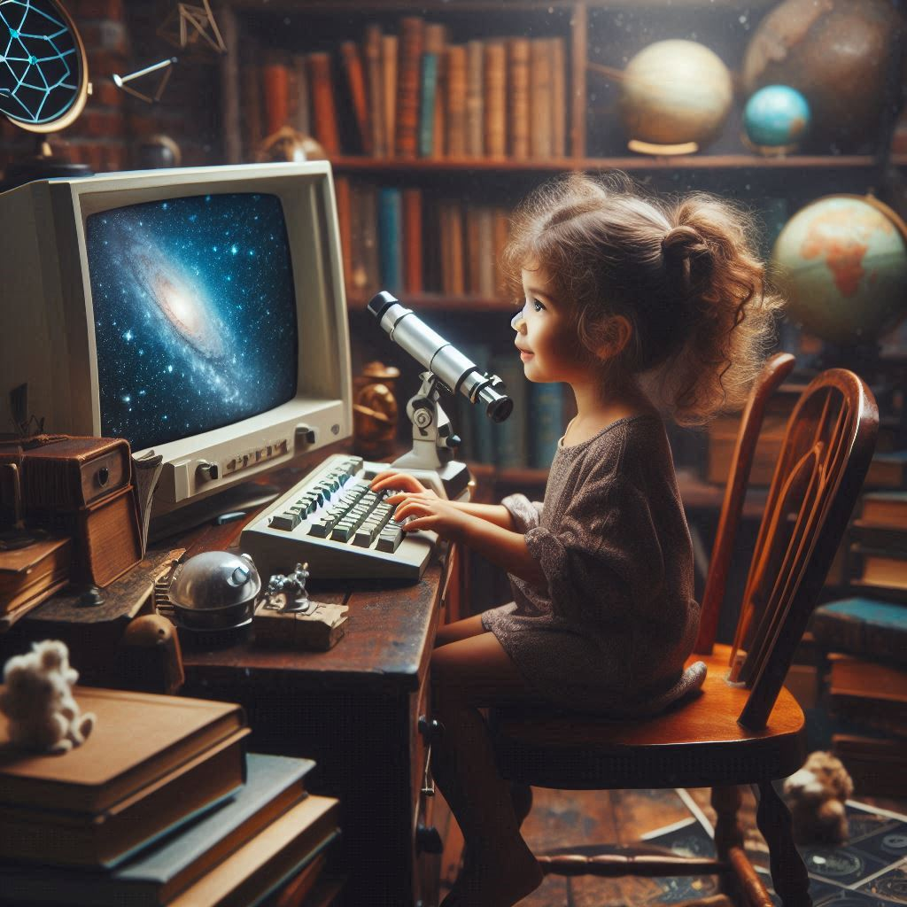
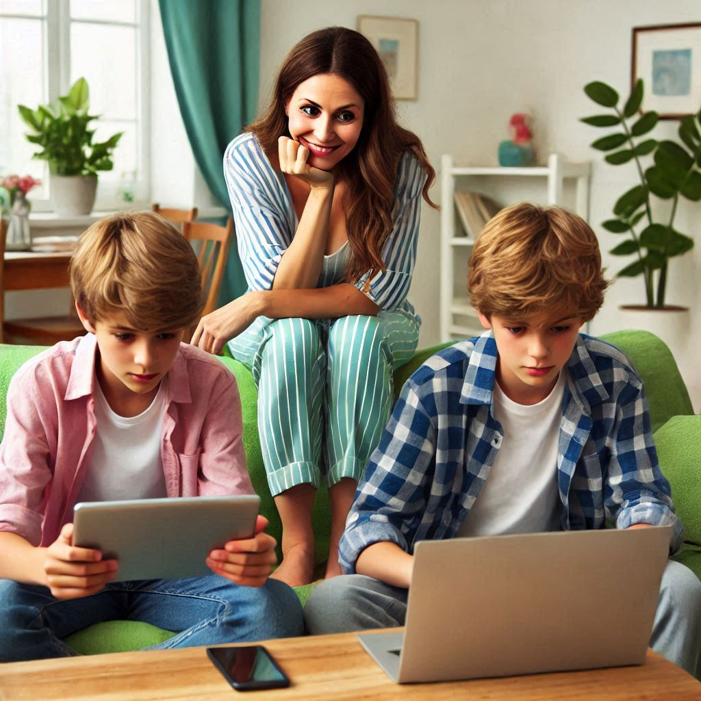

### **O Impacto da Internet: Uma Jornada de Conexão e Transformação**

Era o início dos anos 90 quando Clara, uma adolescente curiosa que vivia em uma pequena cidade, ouviu falar pela primeira vez sobre "a rede mundial de computadores". Na época, o conceito era abstrato e quase mágico: um lugar onde se podia encontrar informações, trocar mensagens e até conhecer pessoas do outro lado do mundo. Clara mal podia imaginar como essa invenção mudaria sua vida e o mundo inteiro.

#### **O Primeiro Contato**

Clara cresceu em uma casa simples, onde o telefone fixo e a televisão eram as principais janelas para o mundo exterior. Quando seu pai, sempre curioso por novidades tecnológicas, comprou um computador com acesso à internet discada, parecia uma revolução. O som do modem conectando era um ritual mágico, e Clara ficou fascinada ao ver páginas carregando lentamente no navegador.

No início, ela usava a internet para pesquisar sobre seus temas favoritos: astronomia e histórias medievais. Logo descobriu salas de bate-papo e fez amizades com pessoas de outros estados, algo que seria impensável sem essa tecnologia.

#### **A Internet no Trabalho**

Anos depois, Clara ingressou na faculdade de jornalismo. Enquanto seus colegas ainda faziam pesquisas em bibliotecas tradicionais, ela se destacou por dominar ferramentas digitais, usando fóruns e sites de notícias internacionais para aprofundar seus estudos. Quando se formou, a internet já havia revolucionado o mercado de trabalho, e Clara conseguiu um emprego em um site de notícias online, algo impensável em sua infância.

Com o tempo, ela percebeu que a internet não era apenas uma ferramenta profissional, mas também um grande democratizador. Pequenos negócios passaram a competir com grandes empresas, criadores de conteúdo independentes encontraram seu público, e movimentos sociais ganharam força e voz global.

#### **O Lado Humano da Tecnologia**

Clara também sentiu na pele o lado emocional da conexão virtual. Quando sua avó adoeceu, a internet foi o canal para que toda a família, espalhada pelo Brasil, se mantivesse conectada. Por meio de videochamadas, sua avó pôde ver e conversar com filhos e netos em tempo real, mesmo nos dias em que a distância física parecia intransponível.

Por outro lado, Clara também enfrentou os desafios da vida online: a pressão das redes sociais, o impacto das notícias falsas e o desafio de desconectar para se reconectar consigo mesma. Ela aprendeu que, embora a internet seja uma ferramenta poderosa, o uso consciente é fundamental.

#### **Um Futuro Ilimitado**

Hoje, Clara olha para seus filhos, que cresceram com smartphones e assistentes de voz, e se pergunta como será o futuro. A internet, que começou como um simples meio de comunicação, tornou-se parte integral da vida humana, moldando a forma como aprendemos, trabalhamos e nos relacionamos.

Ainda assim, Clara nunca esquece o som do velho modem conectando, um lembrete de como uma tecnologia tão revolucionária começou de maneira tão simples. Para ela, a internet não foi apenas uma transformação tecnológica, mas uma força que mudou o mundo ao aproximar pessoas e abrir horizontes, mostrando que o conhecimento e a conexão são os maiores tesouros da humanidade.